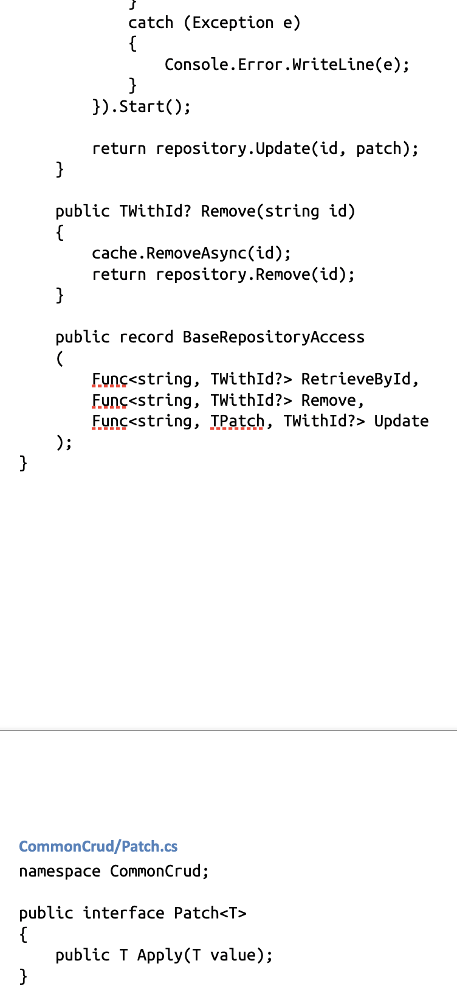

# list_the_source_to_docx

This is console utility for generation single listing [.docx](https://en.wikipedia.org/wiki/Office_Open_XML_file_formats) file out of your codebase.

## Usage

### help

```shell
./lsd.py -h
```

    usage: List the Source to Docs : lsd [-h] [-d DESTINATION] [-f SOURCE_FILES] [-t TITLE_HEADING_LEVEL] [-s SOURCE_STYLE]
    
    This program creates single .docx file from the source code provided
    
    options:
      -h, --help            show this help message and exit
      -d DESTINATION, --destination DESTINATION
                            .docx file where result shall be put
      -f SOURCE_FILES, --source_files SOURCE_FILES
                            Regexp filter of files that shall be included into listing
      -t TITLE_HEADING_LEVEL, --title_heading_level TITLE_HEADING_LEVEL
                            Heading level used for titling styling
      -s SOURCE_STYLE, --source_style SOURCE_STYLE
                            .docx file, which first symbol will be used as source code style reference

### C# project

```shell
lsd = # lsd.py lying somewhere
lsd -d "my_c#_project_listing.docx" -f ".*\/\w*\.cs$" -t 3 
```

    adding Project/Program.cs
    Project/Program.cs added
    adding Project/Directory/A.cs
    Project/Directory/A.cs added
    ...

## Requirements

[here they are](requirements.txt)

---

Generated listing for my own c# solution (fragment):


